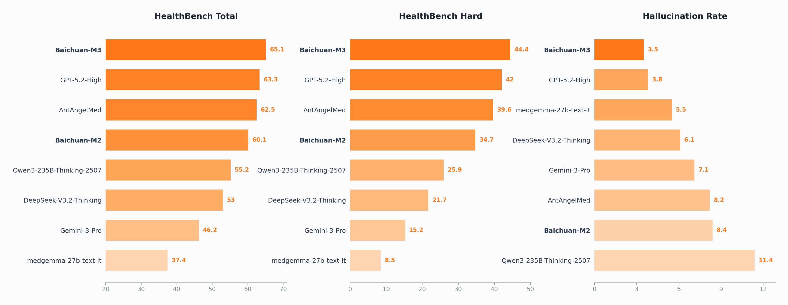
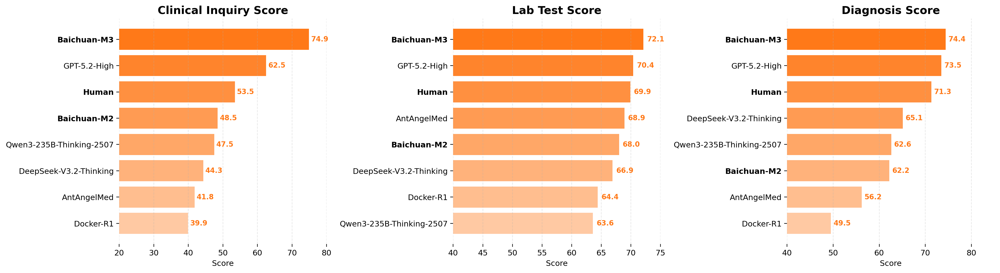
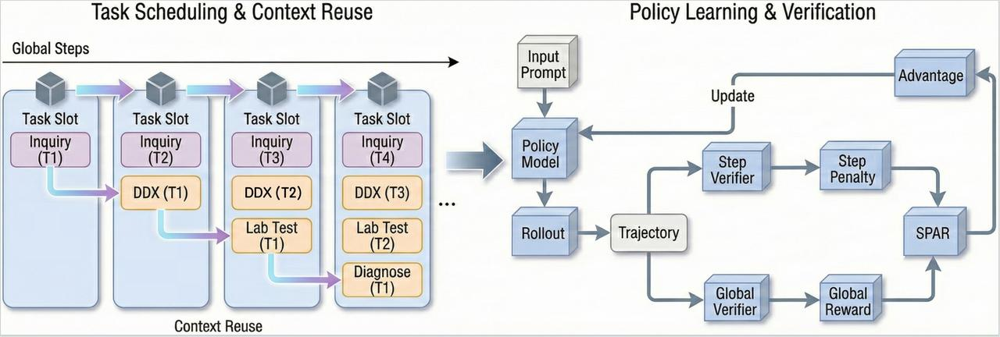
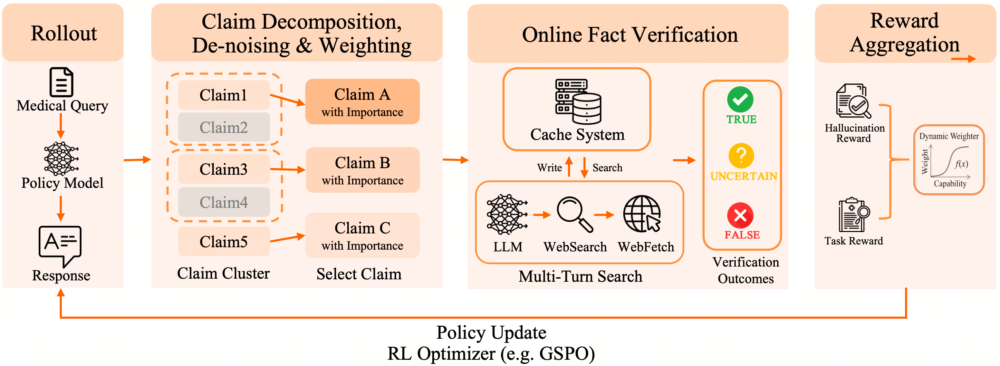

<div align="center">

# Baichuan-M3-235B

[](https://opensource.org/licenses/Apache-2.0)
[](https://huggingface.co/baichuan-inc/Baichuan-M3-235B)
[](https://huggingface.co/baichuan-inc/Baichuan-M3-235B-GPTQ-INT4)
[](https://www.baichuan-ai.com/blog/baichuan-M3)

<h4 align="center">
    <p>
        <b>中文</b> |
        <a href="https://github.com/baichuan-inc/Baichuan-M3-235B/blob/main/README_en.md">English</a>
    <p>
</h4>

**从问诊到决策，构建可信赖的医疗 AI**

</div>

## 🌟 模型简介

**Baichuan-M3** 是百川智能推出的新一代医疗增强大语言模型，继 [Baichuan-M2](https://github.com/baichuan-inc/Baichuan-M2-32B) 之后的又一重要里程碑。

不同于以静态问答或角色扮演为中心的传统范式，Baichuan-M3 以**临床决策过程建模**为核心训练目标，系统性地提升模型在真实医疗场景中的可用性与可靠性。模型不再仅被要求"给出一个看似合理的答案"或"建议您尽快去就诊"这类高频模糊建议，而是被训练为具备**主动收集关键信息**、**构建医学推理路径**、**动态抑制幻觉**的原生医疗增强能力。

### 核心亮点

- 🏆 **超越 GPT-5.2**：在 HealthBench、HealthBench-Hard、幻觉评测及 BCOSCE 评测中全面超越 OpenAI 最新模型，成为全球最强医疗增强模型
- 🩺 **满血问诊能力**：唯一在 BCOSCE 三大核心维度（临床问诊、实验室检查、疾病诊断）均位列榜首的模型
- 🧠 **低幻觉高可靠**：通过 Fact-Aware RL 框架，在无工具辅助下实现显著低于 GPT-5.2 的幻觉率
- ⚡ **高效推理部署**：W4 量化降低 74% 显存占用，Gated Eagle3 投机解码带来 96% 加速


## 📊 性能表现

### HealthBench 与幻觉评测

HealthBench 是 OpenAI 发布的权威医疗评测集，由 262 名来自 60 个国家和地区的执业医师构建，包含 5,000 个高保真多轮临床对话。

<div align="center">
  
</div>

相较于 Baichuan-M2，**Baichuan-M3 在 HealthBench-Hard 上提升 28 个百分点**，达到 44.4 分，超越 GPT-5.2，在 HealthBench 总榜上位列第一。

在幻觉评测中，我们将长文本回答分解为细粒度的可验证原子医学声明，基于权威医学证据进行独立校验。**即使在无工具辅助下，Baichuan-M3 的幻觉率也低于 GPT-5.2。**

### BCOSCE 评测

BCOSCE（BaiChuan Objective Structured Clinical Examination）是我们构建的端到端临床决策评测集，模拟从接诊到确诊的完整临床流程，通过病史收集、辅助检查、精确诊断三个考站评估模型的满血问诊能力。

<div align="center">
  
</div>

Baichuan-M3 **在三大核心维度均位列榜首**的模型，在最具挑战性的临床问诊环节领先次优模型 12.4 分。

> 📢 BCOSCE 评测集将于近期开源发布，敬请期待。


## 🔬 技术特色

> 📖 详细技术介绍请参阅：[技术博客](https://www.baichuan-ai.com/blog/baichuan-M3)

### SPAR：分段流水线强化学习

针对医疗场景极长交互链路的"奖励稀疏"与"信用分配"挑战，我们提出 **SPAR（Step-Penalized Advantage with Relative baseline）** 算法：将临床流程解耦为病史采集、鉴别诊断、检验检查、精确诊断四个独立奖励阶段，配合 OSCE 过程级奖励实现精准的信用分配，驱动模型构建可复核的完整决策逻辑。

<div align="center">
  
</div>

### Fact-Aware RL：事实感知强化学习

通过将事实验证直接融入强化学习循环，我们构建了基于权威医学证据的在线幻觉检测模块，对模型生成的医学声明进行实时校验，并引入高效缓存机制支撑在线强化训练。同时采用动态奖励聚合策略，根据模型能力阶段自适应平衡任务学习与事实性约束，在不牺牲推理深度的前提下显著提升医学事实的可靠性。

<div align="center">
  
</div>

### 高效训练与推理

采用**三阶段多专家融合**训练范式（领域专项 RL → 离线蒸馏 → MOPD 在线优化），配合 **Gated Eagle3 投机解码**（96% 加速）和 **W4 量化**（仅需 26% 显存）实现高效部署。

<div align="center">
  
</div>


## 🔧 快速开始

```python
from transformers import AutoTokenizer, AutoModelForCausalLM

model = AutoModelForCausalLM.from_pretrained("baichuan-inc/Baichuan-M3-235B", trust_remote_code=True)
tokenizer = AutoTokenizer.from_pretrained("baichuan-inc/Baichuan-M3-235B")

messages = [{"role": "user", "content": "我最近总是头痛，尤其是下午更严重，需要怎么处理？"}]
text = tokenizer.apply_chat_template(
    messages,
    tokenize=False,
    add_generation_prompt=True,
    thinking_mode='on'
)
model_inputs = tokenizer([text], return_tensors="pt").to(model.device)

generated_ids = model.generate(
    **model_inputs,
    max_new_tokens=32768,
    temperature=0.6
)
response = tokenizer.decode(generated_ids[0][len(model_inputs.input_ids[0]):], skip_special_tokens=True)
print(response)
```

### 推理部署

使用 `sglang>=0.4.6.post1` 或 `vllm>=0.9.0` 创建 OpenAI 兼容 API：

```shell
# SGLang
python -m sglang.launch_server --model-path baichuan-inc/Baichuan-M3-235B --reasoning-parser qwen3

# vLLM
vllm serve baichuan-inc/Baichuan-M3-235B --reasoning-parser qwen3
```

### MTP 投机解码加速

```shell
python3 -m sglang.launch_server \
    --model baichuan-inc/Baichuan-M3-235B \
    --speculative-algorithm EAGLE3 \
    --speculative-draft-model-path baichuan-inc/Baichuan-M3-235B/draft \
    --speculative-num-steps 6 \
    --speculative-eagle-topk 10 \
    --speculative-num-draft-tokens 32 \
    --mem-fraction 0.9 \
    --reasoning-parser qwen3 \
    --dtype bfloat16
```


## ⚠️ 使用须知

1. **医疗免责声明**：本模型仅供研究和参考，不能替代专业医疗诊断和治疗建议
2. **适用场景**：医学教育、健康咨询、临床辅助决策
3. **安全使用**：建议在专业医疗人员指导下使用


## 📄 许可证

本项目采用 [Apache License 2.0](LICENSE) 开源协议，支持研究和商业使用。

## 🤝 致谢

- 基础模型：Qwen3
- 训练框架：verl
- 推理引擎：vLLM、SGLang

感谢开源社区的贡献，我们将持续回馈社区，推动医疗 AI 技术发展。

## 📞 联系我们

- 官方网站：[百川智能](https://www.baichuan-ai.com)
- 技术交流：[GitHub](https://github.com/baichuan-inc)


<div align="center">

**让医疗 AI 从「能答对题」走向「能支撑决策」**

</div>

## 📚 引用

```bibtex
@misc{baichuan-m3,
    title={Baichuan-M3: Modeling Clinical Inquiry for Reliable Medical Decision-Making},
    author={Baichuan M3 Team},
    year={2025},
    url={https://github.com/baichuan-inc/Baichuan-M3-235B},
}
```
